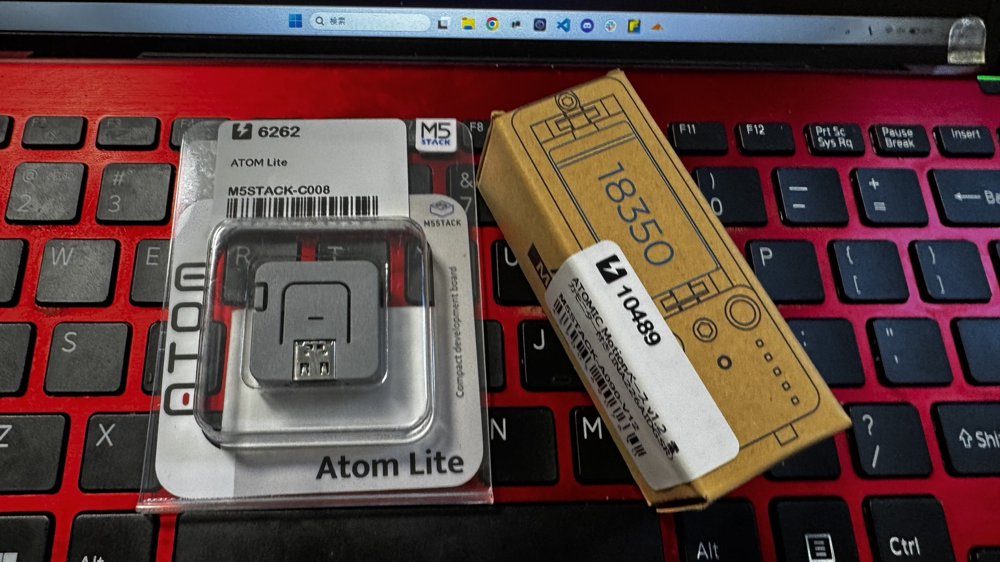
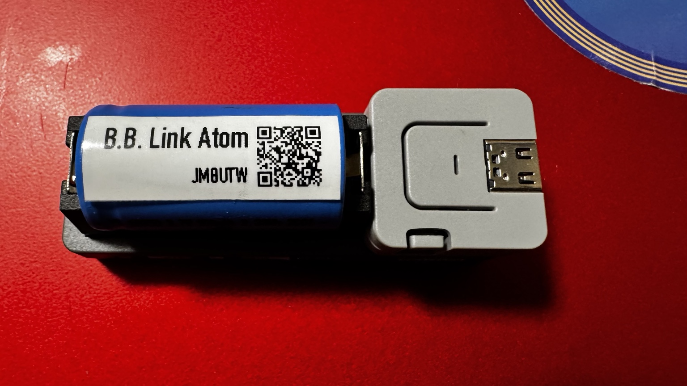

# B.B. Link for M5Stack ATOM Lite

B.B. Link bridges the Bluetooth Classic Serial Port Profile (SPP) of a
Kenwood TH-D74 or TH-D75 to Bluetooth Low Energy (BLE). This allows compatible
iPhone and iPad applications, including RadioMail, to use the radio's built-in
KISS TNC.

This fork targets the **M5Stack ATOM Lite**. The firmware advertises the
compatibility name `B.B. Link` and supports radio discovery, reconnect,
KISS-mode initialisation, rig control, deep sleep, and factory reset.

## Table of contents

- [B.B. Link for M5Stack ATOM Lite](#bb-link-for-m5stack-atom-lite)
  - [Table of contents](#table-of-contents)
  - [Hardware](#hardware)
    - [Air travel with the Tail Bat](#air-travel-with-the-tail-bat)
  - [Build and upload](#build-and-upload)
    - [Arduino IDE](#arduino-ide)
  - [Initial setup](#initial-setup)
    - [Pair the radio](#pair-the-radio)
    - [Connect RadioMail](#connect-radiomail)
  - [Usage](#usage)
    - [Controls](#controls)
    - [LED status](#led-status)
    - [Rig control](#rig-control)
    - [Factory reset](#factory-reset)
  - [Troubleshooting](#troubleshooting)
  - [Repository layout](#repository-layout)
  - [License and upstream project](#license-and-upstream-project)

## Hardware

- [M5Stack ATOM Lite](https://docs.m5stack.com/en/core/ATOM%20Lite)
- USB power source and USB cable, or the optional
  [M5Stack Tail Bat](https://docs.m5stack.com/en/atom/tailbat)
- Kenwood TH-D74 or TH-D75
- iPhone or iPad with
  [B.B. Link Configurator](https://apps.apple.com/us/app/b-b-link-configurator/id6476163710)
  and [RadioMail](https://radiomail.app)





The ATOM Lite can be powered from a USB adapter, power bank, compatible
iPhone/iPad USB connection, or Tail Bat. The firmware uses an 80 MHz CPU clock,
reduced Bluetooth transmit power, and low RGB LED brightness to reduce power
draw. M5Stack specifies a 190 mAh rechargeable lithium battery for the Tail Bat.

> [!TIP]
> The
> [ATOMIC Motion Base v1.2 with Power Monitor (SKU: A090-V12)](https://shop.m5stack.com/products/atomic-motion-base-v1-2-with-power-monitor)
> is another battery-powered option that avoids an external power source or
> USB cable while operating.

### Air travel with the Tail Bat

Carry the B.B. Link and Tail Bat in **carry-on baggage**, not checked baggage.
Keep the Tail Bat switched off and protect the assembly from damage and
accidental activation. If the Tail Bat is detached, insulate its exposed
connector or place it in a separate protective pouch to prevent a short
circuit. Do not carry a damaged, swollen, or recalled battery.

As of August 2026, the
[ICAO Technical Instructions, 2025–2026 Edition, Addendum No. 1](https://www.icao.int/sites/default/files/publications/DocSeries/9284_2025_2026_add_01_en.pdf)
require spare lithium batteries and power banks to be carried in the cabin and
individually protected against short circuits. The
[IATA passenger lithium-battery guidance](https://www.iata.org/contentassets/6fea26dd84d24b26a7a1fd5788561d6e/passengers_travelling_with_lithium_batteries.pdf)
also advises carrying battery-powered devices in hand baggage and checking the
operating airline's policy, which may be stricter.

M5Stack publishes the Tail Bat capacity in mAh but does not show a Wh rating on
its product page. Keep the official Tail Bat specification available when
travelling and ask the airline in advance if it requires a visible Wh rating or
other battery documentation. Airline staff may decline a battery if its rating
cannot be verified.

## Build and upload

Firmware is installed locally via USB using the Arduino IDE.

### Arduino IDE

1. Install the latest [Arduino IDE](https://www.arduino.cc/en/software).
2. [Setup M5Stack Environment](https://docs.m5stack.com/en/arduino/arduino_board)
3. Install these libraries in Library Manager:

   | Library | Version |
   | --- | ---: |
   | M5Unified | 0.2.19 |
   | FastLED | 3.10.5 |
   | ArduinoQueue | 1.2.5 |

4. Open `bb-link.ino`.
5. Select **M5Atom** from **Tools > Board**. This matches M5Stack's
   [official ATOM Lite upload guide](https://docs.m5stack.com/en/arduino/m5atom/program).
6. Select the ATOM Lite serial port and click **Upload**.

## Initial setup

### Pair the radio

1. Power on the ATOM Lite.
2. Open B.B. Link Configurator and select `B.B. Link`.
3. On the radio, open **Menu > Bluetooth > Pairing Mode**.
4. In the Configurator, open **Paired Radio** and select the radio.
5. Accept the pairing request on the radio.

The pairing is stored, and the adapter reconnects automatically after restart.
A breathing blue LED indicates that the saved radio is connected.

### Connect RadioMail

1. Fully close B.B. Link Configurator.
2. In RadioMail, open **Settings > KISS TNC Modem > Default TNC**.
3. Select `B.B. Link`, then tap **Done**.
4. Open the connection screen and select a packet station.

A solid blue LED indicates that both the radio and the iOS device are connected.

## Usage

### Controls

| Action | Result |
| --- | --- |
| Short press | Enter charging mode (Bluetooth off until restart) |
| Hold for 2 seconds while running | Enter deep sleep |
| Press while sleeping | Wake the adapter |

### LED status

| LED | State |
| --- | --- |
| 🟡 | Waiting to pair |
| 🔵 Slow flashing | Scanning for the radio |
| 🔵 Breathing | Radio connected; waiting for iOS |
| 🔵 Solid | Radio and iOS connected |
| 🟡 Fast flashing | Entering deep sleep |
| 🩵 Slow flashing | Battery charging mode; Bluetooth disabled |
| 🔴 Slow flashing | Fatal error; reset required |
| 🟢 Activity | Receiving from the radio |
| 🔴 Activity | Transmitting to the radio |
| 🟣 Activity | Simultaneous receive/transmit activity |

The stock [Tail Bat](https://docs.m5stack.com/en/atom/tailbat) documentation
reports charging and full-charge state only on its own red indicator (flashing
while charging and solid when full), and documents no battery-state signal to
the ATOM Lite. The cyan ATOM LED therefore identifies the Bluetooth-off
charging mode rather than measured state of charge. Deep pink is reserved for
low battery and white for full charge if future hardware exposes those states.

### Rig control

Rig control is enabled by default. The adapter initialises KISS mode and can
respond to RadioMail frequency-change commands. Disable **Control Frequency**
in B.B. Link Configurator if the adapter must not change radio settings.

### Factory reset

Use **Reset Adapter** in B.B. Link Configurator, or connect a serial monitor at
115200 baud and send an uppercase `R`. This clears saved configuration and
Bluetooth pairing information.

## Troubleshooting

If the adapter connects but the radio does not transmit, open
**Menu > Configuration > Interface > KISS (983)** on the radio and set KISS to
**Bluetooth**.

## Repository layout

```text
bb-link.ino        Arduino sketch entry point
src/               Firmware implementation and headers
LICENSE            GPL-3.0 license
README.md          Build and operating instructions
```

The repository root is the Arduino sketch directory, named `bb-link` to match
`bb-link.ino`. Its internal C++ sources are kept in the sketch's `src/`
directory, which Arduino compiles recursively according to the
[official sketch specification](https://docs.arduino.cc/arduino-cli/sketch-specification/#src-subfolder).

## License and upstream project

This project is licensed under GPL-3.0.

The original B.B. Link project and product documentation were maintained by
[Island Magic Co.](https://islandmagic.co/bb-link), with the upstream source at
[islandmagic/bb-link](https://github.com/islandmagic/bb-link).
